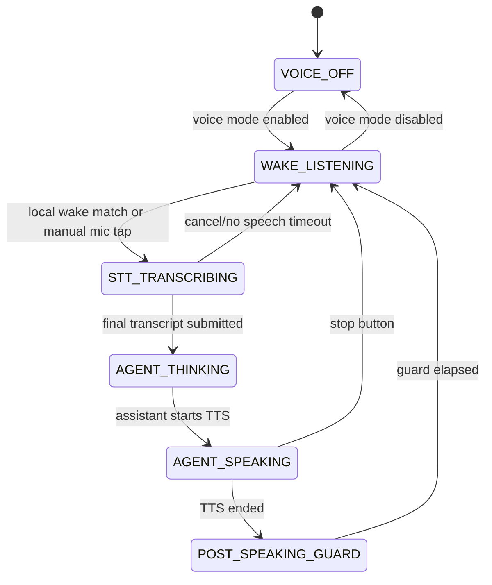

# Voice Mode Wake Word Design

**Lane:** VOICE-MODE-WAKE-WORD-1  
**Status:** design review, implementation intentionally deferred  
**Date:** 2026-05-02  
**Owner:** Codex  
**Related:** `docs/specs/adr-010-wake-word-engine.md`,
`docs/contracts/ios-deepgram-integration.md`,
`docs/doctrines/mic-vs-send-button.md`

## Summary

Voice mode should rest in a local wake-word state, not in continuous
cloud transcription. The default loop becomes:

```text
WAKE_LISTENING
  -> STT_TRANSCRIBING
  -> AGENT_THINKING
  -> AGENT_SPEAKING
  -> WAKE_LISTENING
```

The wake listener processes microphone frames locally. Deepgram Nova-3
opens only after a local wake match. Deepgram remains the STT/TTS
provider after activation; it is not the wake gate.

Recommendation for the implementation lane: ship Porcupine first for the
demo path, because it already has Web and iOS SDKs, custom "Hey Lumo"
models, and the lowest delivery risk. Keep OpenWakeWord as the open
fallback/research track. Do not use Deepgram keyterm/search as wake-word
detection because it requires sending audio to Deepgram before the wake
match.

This is a design proposal for Kalas review. It updates the tactical
implementation recommendation from ADR-010's custom-CNN-first stance but
does not supersede ADR-010 until reviewed.

## Goals

- Stop continuous passive STT.
- Preserve the privacy invariant: no cloud audio before wake.
- Use the exact wake phrase "Hey Lumo" for product behavior.
- Keep browser and iOS behavior aligned even if implementation APIs differ.
- Leave tap-to-talk/manual mic behavior available as a fallback.

## Non-Goals

- No code changes in this design commit.
- No always-on background mobile wake behavior beyond platform limits.
- No voice biometric authentication.
- No custom model training pipeline in this lane.
- No removal of Deepgram STT/TTS; wake word sits before Deepgram.

## Engine Evaluation

| Option | Fit | Strengths | Risks |
|---|---|---|---|
| Picovoice Porcupine | Recommended v1 | On-device; Web and iOS SDKs; custom wake words via Picovoice Console; production-grade latency/resource profile; existing `apps/web/lib/wake-word.ts` scaffold is already Porcupine-shaped. | Commercial dependency; public browser access key; model assets per platform; licensing approval needed before broad launch. |
| OpenWakeWord | Keep as fallback/spike | Open-source framework; pretrained English models including "hey mycroft" and "hey jarvis"; supports ONNX/TFLite in Python; custom model training path exists. | No official browser JS implementation for the full library; web examples stream audio to a Python backend, which violates our pre-wake privacy goal unless ported locally; bundled pretrained models are non-commercially licensed; "Hey Lumo" needs custom training and QA. |
| Deepgram keyword/keyterm/search | Reject as wake gate | Already integrated; keyterm prompting can improve Nova-3 recognition after activation. | Cloud feature, not local wake detection. It needs audio sent to Deepgram before a match, adds network latency/cost, and breaks the privacy model. |

Source notes:

- Picovoice documents Porcupine as an on-device KWS engine with Web and
  iOS support, custom wake-word training, and local processing.
- Picovoice Web docs show `.ppn` custom keyword models for Web (WASM)
  and the `PorcupineWorker` lifecycle.
- OpenWakeWord documents pretrained models, 16kHz PCM frame inference,
  model training, ONNX/TFLite support, and a browser caveat: the full JS
  port is not currently provided.
- Deepgram Nova-3 keyterm prompting is a cloud STT customization feature,
  useful after wake, not a local wake detector.

## Wake Phrase

Product phrase: **"Hey Lumo"**.

"Hey Lumo" needs a custom model for both Porcupine and OpenWakeWord.
Porcupine can generate platform-specific `.ppn` files through Console.
OpenWakeWord can train a custom model, but the repo guidance makes that a
model-quality exercise rather than a drop-in integration.

Placeholder options:

- Porcupine built-in "computer" can smoke-test the state machine with the
  existing scaffold.
- OpenWakeWord pretrained "hey mycroft" can smoke-test local wake logic in
  a development build, but its pretrained model licensing and off-brand
  phrase make it a poor public YC demo choice.
- OpenWakeWord "hey jarvis" is closer to the vibe but is still not the
  product wake phrase and carries the same pretrained-model caution.

Recommendation: do not demo "Hey Mycroft" publicly unless explicitly
framed as an engineering placeholder. Prefer getting a Porcupine "Hey
Lumo" model before the YC demo, or fall back to tap-to-talk for any public
demo where the branded model is not ready.

## State Machine



States:

- `VOICE_OFF`: no mic capture.
- `WAKE_LISTENING`: local wake engine owns mic frames; Deepgram STT is
  closed; no transcript is produced.
- `STT_TRANSCRIBING`: one user turn is streamed to Deepgram Nova-3.
- `AGENT_THINKING`: no mic capture unless an explicit cancel/retry flow
  requires it.
- `AGENT_SPEAKING`: TTS is active; STT is paused.
- `POST_SPEAKING_GUARD`: short tail guard, currently 300 ms in the STT
  gating lane, to avoid catching speaker reverb.

Manual mic/tap-to-talk remains available. It transitions directly from
`WAKE_LISTENING` or `VOICE_OFF` into `STT_TRANSCRIBING`, but it does not
change the resting-state rule.

The iOS composer doctrine remains unchanged: when STT is active,
listening wins over typed-input/send state.

## Browser Implementation Surface

Existing surfaces:

- `apps/web/components/VoiceMode.tsx`
- `apps/web/lib/wake-word.ts`
- `apps/web/app/settings/wake-word/page.tsx`
- `apps/web/app/onboarding/wake-word/page.tsx`
- `apps/web/components/wake-word/WakeWordTest.tsx`
- `apps/web/components/wake-word/MicIndicator.tsx`

Implementation shape:

1. Replace `VoiceMode`'s idle auto-listening/resting behavior with
   `WAKE_LISTENING`.
2. Move the current Porcupine scaffold behind a common engine interface:

   ```ts
   export interface WakeWordEngine {
     start(): Promise<void>;
     stop(): Promise<void>;
     destroy(): Promise<void>;
     onWake(cb: (event: WakeWordEvent) => void): void;
     onError(cb: (error: WakeWordError) => void): void;
   }

   export interface WakeWordEvent {
     phrase: "Hey Lumo" | string;
     confidence: number | null;
     engine: "porcupine" | "openwakeword";
     occurred_at: string;
   }
   ```

3. Use local Web Audio / SDK microphone capture during
   `WAKE_LISTENING`.
4. Start the existing Deepgram STT stream only after `onWake`.
5. Stop wake listening while `STT_TRANSCRIBING`, `AGENT_THINKING`,
   `AGENT_SPEAKING`, and `POST_SPEAKING_GUARD` are active.
6. Resume wake listening only after TTS playback and the guard window.
7. Surface states in the existing mic indicator:
   - "Listening for Hey Lumo"
   - "Wake word heard"
   - "Listening"
   - "Thinking"
   - "Speaking"
8. Settings/onboarding remain opt-in. If the configured engine cannot
   load, keep tap-to-talk working and show a non-blocking unavailable
   state.

Proposed browser env/config:

- `NEXT_PUBLIC_LUMO_WAKE_WORD_ENABLED=1`
- `NEXT_PUBLIC_LUMO_WAKE_WORD_ENGINE=porcupine`
- `NEXT_PUBLIC_PORCUPINE_ACCESS_KEY=<public Picovoice access key>`
- `NEXT_PUBLIC_LUMO_WAKE_WORD_SENSITIVITY=0.7`
- `LUMO_WAKE_WORD_AUDIT_ENABLED=1`

The public Picovoice access key is not a secret in the same class as
server API keys, but it is still deployment-controlled and should not be
hard-coded.

## iOS Implementation Surface

Paired lane: `IOS-VOICE-MODE-WAKE-WORD-1`.

Recommended if Porcupine is selected:

- Bundle the iOS-specific `Hey Lumo` `.ppn` model.
- Use the Porcupine iOS SDK for local wake detection.
- Keep Deepgram token fetch + Nova-3 WebSocket behavior exactly as defined
  in `docs/contracts/ios-deepgram-integration.md` after wake.
- Suspend wake detection during STT/TTS and resume after the same tail
  guard.
- Reuse the same user-facing state names as web where possible.

Platform caution:

- Foreground app wake-word listening is realistic for the demo.
- Background always-on wake behavior on iOS is constrained by platform
  policy and battery behavior. Treat background wake as a separate mobile
  research lane, not as part of the first implementation.

If OpenWakeWord is selected instead, iOS needs a separate Core ML or ONNX
Runtime Mobile path plus model conversion/benchmarking. That is higher
risk than Porcupine for the next sprint.

## Privacy Model

Invariant: **no audio leaves the device before the wake word fires**.

Design rules:

- Pre-wake frames are processed locally and dropped.
- No pre-wake frames are stored in IndexedDB, localStorage, telemetry, or
  logs.
- No fetch/WebSocket sends audio during `WAKE_LISTENING`.
- The UI shows that the mic is locally active.
- Wake-word opt-in is explicit and reversible.
- Wake events may log metadata (`engine`, `confidence`, `latency_ms`) but
  never raw audio.

Deepgram starts only in `STT_TRANSCRIBING`, after wake or manual tap.

## Demo Readiness

Best YC path:

1. Generate Porcupine custom models for "Hey Lumo" for Web (WASM) and
   iOS.
2. Implement browser wake listening behind a feature flag.
3. Implement iOS against the same state machine.
4. Run a 20-utterance room-noise smoke with Kalas's laptop + iPhone.

Acceptable internal engineering placeholder:

- Porcupine built-in "computer" or OpenWakeWord "hey mycroft" to validate
  transitions before the custom model arrives.

Not recommended for public YC demo:

- Saying "Hey Mycroft" to wake Lumo. It is off-brand, introduces
  licensing/review ambiguity for OpenWakeWord pretrained models, and
  makes the JARVIS moment feel less intentional.

If "Hey Lumo" is not ready, prefer a visible tap-to-talk fallback for the
public demo over an off-brand wake phrase.

## Implementation Lane Proposal

After Kalas review, scope the implementation as:

1. `WAKE-WORD-PORCUPINE-ENGINE-1`
   - Install/wire Web Porcupine SDK.
   - Add `Hey Lumo` Web `.ppn` and parameter asset.
   - Replace no-op scaffold with production `WakeWordEngine`.
   - Tests for local-only pre-wake network silence.

2. `VOICE-MODE-WAKE-WORD-IMPL-1`
   - Replace continuous passive STT resting state with
     `WAKE_LISTENING`.
   - Integrate with STT gating and TTS tail guard.
   - Update settings/onboarding copy and smoke tests.

3. `IOS-VOICE-MODE-WAKE-WORD-1`
   - Bundle iOS model.
   - Implement native wake state machine.
   - Deepgram starts only after local wake.

4. `OPENWAKEWORD-SPIKE-1` (deferred)
   - Evaluate a fully local browser port with `onnxruntime-web`.
   - Produce benchmark data before any vendor swap decision.

## Open Questions for Review

- Does Kalas accept Porcupine as the v1/demo implementation despite
  ADR-010's custom-CNN-first decision?
- Do we have or can we immediately create Picovoice Console access for a
  Web and iOS "Hey Lumo" custom model?
- Should wake-word listening be browser-only first, or should iOS be
  blocked until the same model is available?
- What product fallback should we show if wake model load fails:
  tap-to-talk only, or a temporary built-in keyword for internal users?

## References

- Picovoice Porcupine overview:
  https://picovoice.ai/products/voice/wake-word/
- Picovoice Porcupine docs:
  https://picovoice.ai/docs/porcupine/
- Picovoice Porcupine Web API:
  https://picovoice.ai/docs/api/porcupine-web/
- Picovoice Porcupine Web custom keyword quickstart:
  https://picovoice.ai/docs/quick-start/porcupine-web/
- OpenWakeWord repository:
  https://github.com/dscripka/openWakeWord
- OpenWakeWord `hey_jarvis` model notes:
  https://github.com/dscripka/openWakeWord/blob/main/docs/models/hey_jarvis.md
- Deepgram Nova-3 keyterm prompting:
  https://developers.deepgram.com/docs/keyterm
- Deepgram streaming STT feature overview:
  https://developers.deepgram.com/docs/stt-streaming-feature-overview
