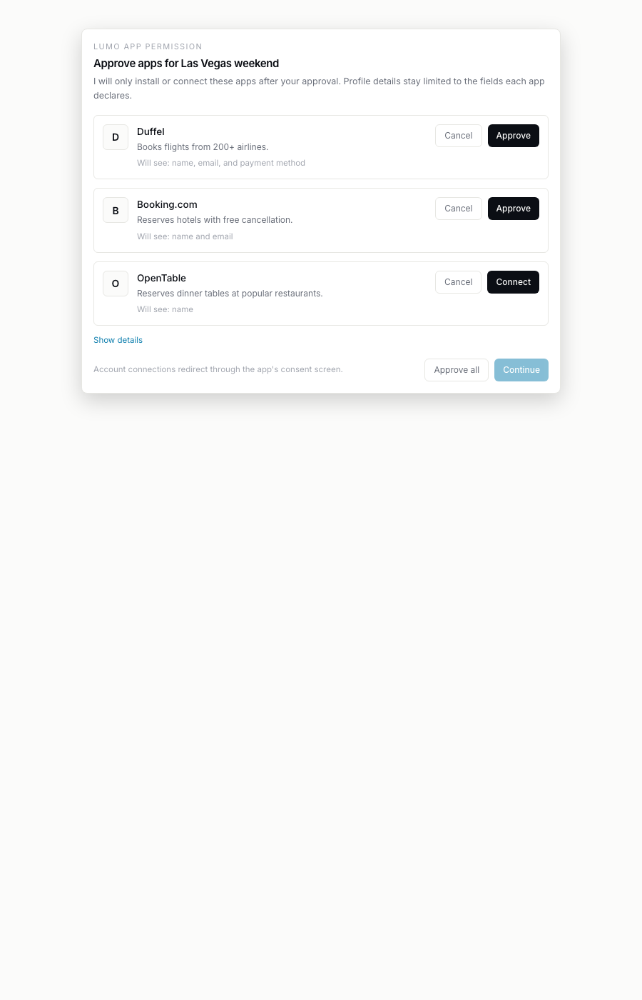
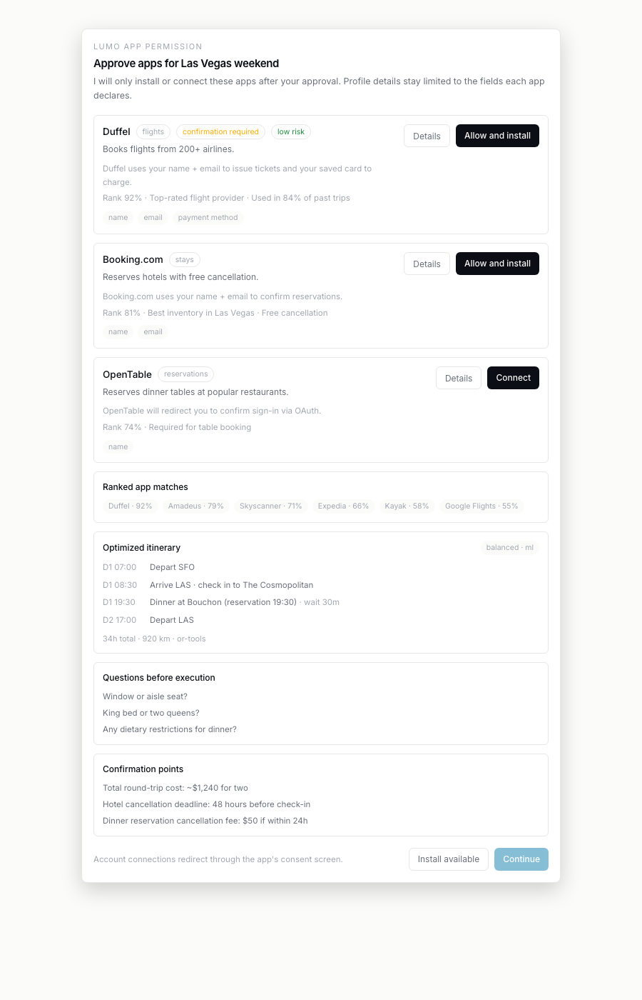
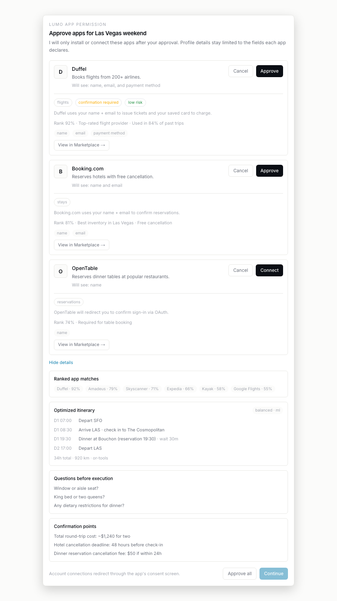

# APP-INSTALL-UX-MINIMAL-1 — progress + ready-for-review, 2026-05-01

Branch: `claude-code/app-install-ux-minimal-1` (2 commits, branched
from `origin/main` at the IOS-MIRROR-WEB-1 close).

## What shipped

`LumoMissionCard.tsx` flips from a developer-dashboard render into
a focused install prompt. The brief named five things to remove from
the default view and one disclosure to add. All landed in one
component edit + one helper extract; tests + a public fixture page +
a capture script came in the second commit.

| Δ | Change | Outcome |
|---|---|---|
| 1 | Default per-proposal layout | App initial-circle icon + name + one-liner + one-line scope summary + Cancel + Approve. That's it. The chip list, capability badge, marketplace deep-link, permission paragraph, rank %, and rank-reasons all moved behind `showDetails`. |
| 2 | `scopeSummary(proposal)` helper | Pure function in `apps/web/lib/lumo-mission-card-helpers.ts`. Reads `profile_fields_requested` and emits one of: "Won't access your profile" (0) / "Will see: name" (1) / "Will see: name and email" (2) / "Will see: name, email, and payment method" (3) / "Will see: name, email, and 3 more" (4+). Extracted to `.ts` so tests can import via `--experimental-strip-types`. |
| 3 | "Show details" disclosure | A single `useState<boolean>(false)` at card scope, toggled by a `data-testid="mission-card.show-details"` button at the top of the proposals list. Reveals the chip block per proposal *and* the four card-level sections the brief moved out of default — Ranked app matches, Optimized itinerary, Questions before execution, Confirmation points. |
| 4 | Per-proposal Cancel | New `declined: Set<string>` state. Cancel adds the agent_id; the row swaps Approve/Cancel for a "Cancelled" pill. Continue's gate now reads `activeAutoInstallable` (excludes declined), so a fully-declined card unlocks Continue — no more dead-end. |
| 5 | Footer relabel | "Install available" → "Approve all". Per-row primary-action copy is "Approve" (was "Allow and install"). One vocabulary across the card. |

## Before / after

Both passes were captured with the same playwright tooling against
the same fixture (`/fixtures/mission-card`) with the same seed plan.
The only thing that differs is the code under
`components/LumoMissionCard.tsx`.

### Default view (no disclosure)

| Before — `origin/main` | After — `claude-code/app-install-ux-minimal-1` |
|---|---|
|  |  |
| Per proposal: header chips (`flights · auto-install`), permission paragraph, rank pill (`Top 0.92 · #1`), rank-reasons line, `Connect …` deep-link, "Personal data the app will see" header + `name` `email` `payment method` chips. Card footer also surfaces "Ranked app matches" (6 entries), "Optimized itinerary" (4 stops), "Questions before execution" (3), and "Confirmation points" (3). | App initial-circle icon + name + one-liner + one-line scope summary ("Will see: name, email, and payment method") + Cancel + Approve. Card footer: just the existing Continue + Cancel mission. The four removed-from-default sections sit behind a single `Show details` link. |

### Expanded view (`Show details` clicked)

| Before — `origin/main` | After — `claude-code/app-install-ux-minimal-1` |
|---|---|
|  |  |
| Identical to "before/default" — there was no disclosure in production, so the variant captures collapsed onto each other. | Same minimal default header, but every per-proposal block now expands to show permission-copy + rank line + chip list, and the four card-level sections (Ranked app matches, Optimized itinerary, Questions, Confirmation points) appear below. Show details flips to "Hide details". |

(Dark variants captured for every shot — see
`docs/notes/app-install-ux-minimal-1-screenshots/{before/}` for the
light + dark pairs.)

## Tests

**12 new tests** in `apps/web/tests/app-install-ux-minimal-1.test.mjs`.
Two kinds of assertions:

- **Pure-helper tests against `scopeSummary`** (5): cover 0 / 1 / 2 /
  3 / 4+ field counts; verify Oxford-comma phrasing on 3 and the "and
  N more" clamp on 4+.
- **Source-level structural tests on `LumoMissionCard.tsx`** (7):
  assert each removed-from-default section header (`Ranked app
  matches`, `Optimized itinerary`, `Questions before execution`,
  `Confirmation points`) sits inside a `showDetails && …` block;
  assert the disclosure button exists with the expected
  data-testid + toggle copy; assert the per-proposal `showDetails ?
  …` block contains permission_copy → rank_score →
  profile_fields_requested in that order; assert the new
  Approve/Cancel data-testids are wired; assert the declined-state
  swap renders "Cancelled"; assert the Continue gate reads
  `activeAutoInstallable.length` (so a fully-declined card unlocks
  Continue); assert the footer relabel ("Approve all", per-row
  return "Approve") and that the old "Install available" copy is
  fully gone.

This mirrors the same source-level pattern used in
`web-redesign-mobile-nav` / `web-screens-account` — the repo doesn't
ship a React renderer for unit tests, so structural assertions are
the standard substitute.

Wired into `npm test`. Full suite passes.

## Gates

- `npm run typecheck` — green.
- `npm run lint` — green; only pre-existing warnings in three
  untouched files (RightRail ``, EndpointTable `aria-sort`,
  SampleRecorder `useCallback` deps).
- `npm run lint:registry` — green.
- `npm run lint:commits` — green.
- `npm run build` — green.
- `npm test` — green; full suite + 12 new tests.

## Out of scope (per brief)

- iOS approval card — no iOS counterpart exists today; install
  flow on iOS goes through the marketplace directly. If a card-shaped
  install gets ported to iOS later, a follow-up sprint reuses the
  same `scopeSummary` helper + Approve/Cancel/Show-details vocabulary.
- Telemetry on Show-details click-through — the disclosure does not
  yet `logPreferenceEvent`. Easy to add when the analytics ask
  comes in; the existing per-proposal Approve already fires
  `lumo.install.proposal.approve`.

## Notes for review

1. **`apps/web/lib/lumo-mission-card-helpers.ts`** is a one-export
   helper file. It only exists to be importable from a `.mjs` test
   under `--experimental-strip-types` (which handles `.ts` but
   chokes on `.tsx`). The component imports from it too, so there's
   exactly one definition.

2. **Public `/fixtures/mission-card` route.** Renders the card
   against a deterministic `LumoMissionPlan` seed (3 proposals
   exercising every scope-summary branch, 6 ranked alternatives, a
   4-stop itinerary, 3 questions, 3 confirmation points). Used by
   the capture script — same data drives both before + after shots.
   `middleware.ts` already lets `/fixtures/*` through; no auth
   gating change needed.

3. **`scripts/app-install-ux-minimal-1-capture.mjs`** is the
   canonical capture path going forward. Drives 4 PNGs (default +
   expanded × light + dark) by clicking the disclosure for the
   expanded variants. Tolerant of the disclosure being absent (the
   pre-redesign card has no testid), so the same script can be
   pointed at any older revision via `LUMO_SHOTS_SUBDIR=before`. The
   before-state shots in this lane were captured exactly that way:
   `git checkout origin/main -- apps/web/components/LumoMissionCard.tsx`,
   re-run capture into `before/`, restore from HEAD.

4. **`activeAutoInstallable` Continue gate (regression risk).** The
   previous gate read raw `autoInstallable.length`, so declining
   every proposal would leave Continue disabled forever. Now reads
   `autoInstallable.filter((p) => !declined.has(p.agent_id))`. A
   reviewer should sanity-check that the existing
   "all installed → Continue enabled" branch still works (it does;
   `allAutoInstalled` short-circuits before the active-length
   check, same as before).

5. **`AppIcon` is a tiny initial-circle.** No remote asset fetching
   in this lane. When a real icon URL ships from the marketplace
   schema, swap in `<Image src={agent.icon_url}>` and keep the
   initial-circle as fallback. ~12 LOC change.

6. **Why both sets of screenshots live under one dir.** The
   `before/` subdir convention keeps the before/after pair side-by-
   side in `docs/notes/`, mirroring `web-redesign-1-screenshots-*`'s
   pattern but more compact (one parent dir instead of two).

## Estimate vs actual

Brief implied 1 component refactor + tests + 4 screenshots; actual
~700 LOC component (was ~544) + 30 LOC helper + 157 LOC tests + 216
LOC fixture page + 75 LOC capture script + 8 PNGs across 2 commits.
~1 medium session.

Ready for review. Merge instructions per the standing FF-merge
protocol.
