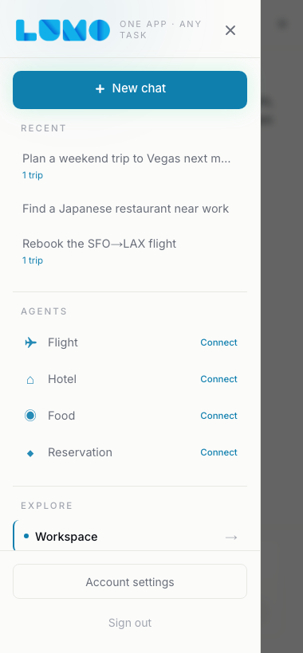
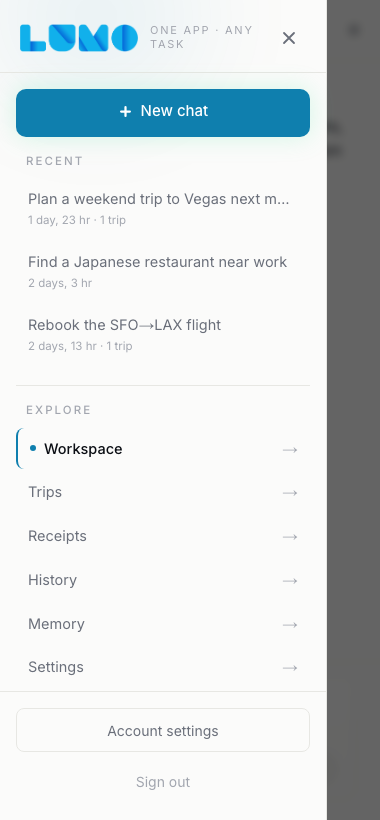
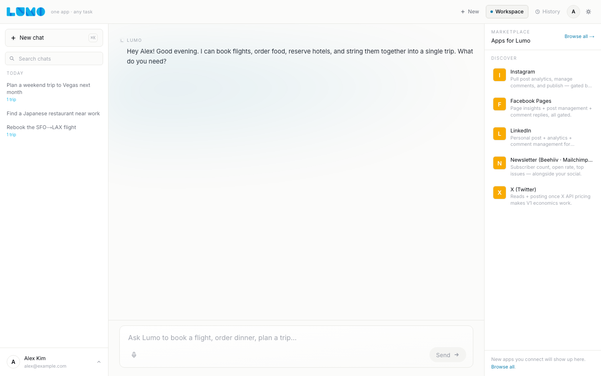
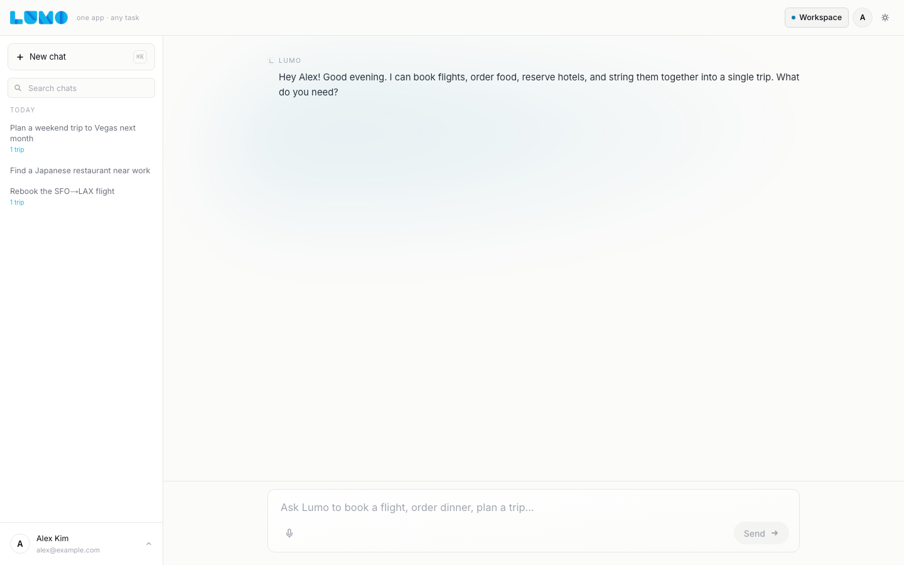
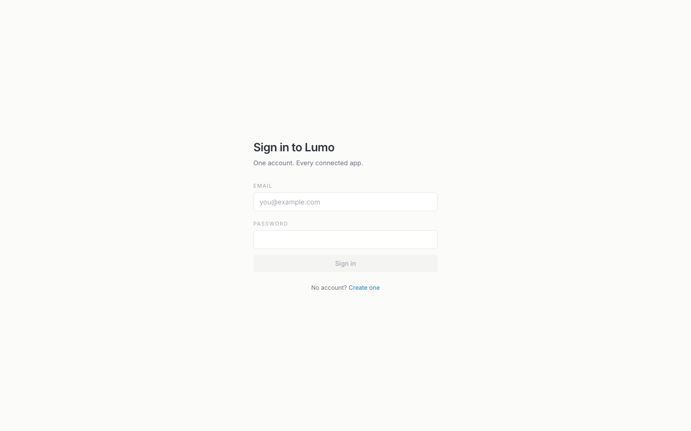
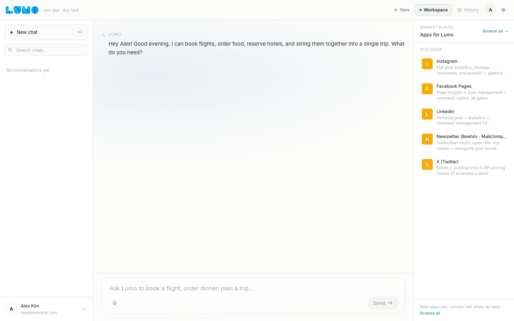
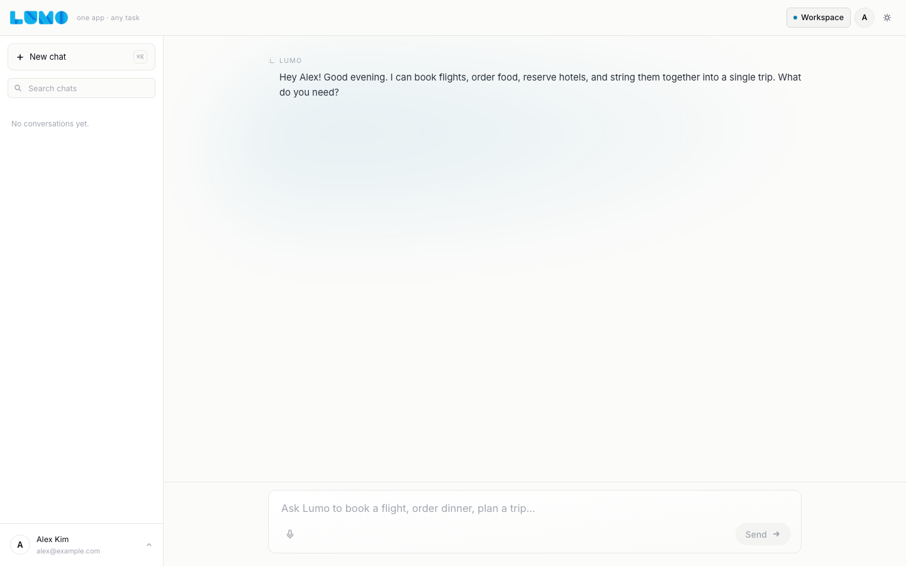

# WEB-REDESIGN-1 — progress + ready-for-review, 2026-04-30

Branch: `claude-code/web-redesign-1` (6 commits, branched from
`origin/main` at `c1ffb32`).

## What shipped

All four brief deltas. Each is one logical commit.

| Δ | Surface | Outcome |
|---|---|---|
| 1 | AGENTS section in `LeftRail.tsx` and `MobileNav.tsx` | `MobileNav` BASELINE_AGENTS const + AgentRow interface + agents state + render section all gone (45 LOC of render + ~75 LOC of fetch). `LeftRail` already had no AGENTS surface (pre-redesign rewrite had moved it to `/admin/apps`); the brief overstated. Confirmed with a regression-guard test. |
| 2 | Auth gate on `/` for unauthed visitors | `middleware.ts` adds `PROTECTED_PAGE_EXACT = ["/"]` (kept separate from `PROTECTED_PAGE_PREFIXES` so `/` doesn't gate the whole site). Unauthed visitors redirect to `/login?next=/`. Authed users still land on the chat. Top-of-file doc block updated to move `/` from Public to Protected. |
| 3 | Top-right chrome — Sign-in, History, New chat | All three buttons removed from `app/page.tsx`. Workspace, the avatar chip (when signed in), and ThemeToggle preserved. Mobile hamburger and brand wordmark unchanged. |
| 4 | RightRail removed from chat shell | `RightRail` import + JSX mount removed from `app/page.tsx`. The `activeTrip` useMemo + ActiveTripView/LegStatusLite type imports went with it. `memoryRefreshKey` state + setters removed (only consumer was RightRail). `RightRail.tsx` file kept in tree for reference until COMPOUND-EXEC-2 reintroduces per-leg dispatch inline. |

## Before / after

Both passes were captured with the same playwright tool against the
same fixture data — the only thing that differs is the code. Captures
use `mockAuthedShell()` to fake `/api/me`, `/api/history`, etc. so the
shell renders identically in both passes.

### Mobile drawer (380px viewport)

| Before — `origin/main` | After — `claude-code/web-redesign-1` |
|---|---|
|  |  |
| AGENTS section visible with all four specialists (Flight, Hotel, Food, Reservation), each rendering a "Connect" affordance pulled from `/api/connections`. | AGENTS section gone entirely — RECENT flows directly into EXPLORE. Connection management still reachable via `/connections` (still listed in EXPLORE). |

### Chat with recents (desktop)

| Before — `origin/main` | After — `claude-code/web-redesign-1` |
|---|---|
|  |  |
| Top-right chrome shows New thread + Workspace + History + Sign-in + ThemeToggle (or avatar). RightRail aside on the right hosts "Marketplace / Apps for Lumo / Loading…". | Top-right shows just Workspace + ThemeToggle + (avatar when signed in). RightRail aside is gone — chat column extends to the right edge. LeftRail and chat column unchanged in posture. |

### Login / signed-out

| Before — `origin/main` | After — `claude-code/web-redesign-1` |
|---|---|
|  |  |
| `/login` form is identical pre/post (this lane didn't touch the form). The redesign's behavioural change is what _gets_ users here — unauthed `/` now redirects to `/login?next=/`. | Same form. The route is now the canonical landing for any unauthed visitor instead of the bottom of an "auth chip" funnel. |

### Chat empty (signed-in)

| Before — `origin/main` | After — `claude-code/web-redesign-1` |
|---|---|
|  |  |
| Three nav buttons in top-right + RightRail. | Two nav elements + ThemeToggle + (avatar). No right rail. |

(Dark variants captured for every shot — see
`docs/notes/web-redesign-1-screenshots/{light,dark}` and
`docs/notes/web-redesign-1-screenshots-before/{light,dark}`.)

## Tests

**18 new tests** across 3 source-level contract suites + all existing tests stay green:

- `web-redesign-mobile-nav` (8): asserts `BASELINE_AGENTS` const,
  `AgentRow` interface, agents state, and Agents render section are
  all gone. Recent / Explore / auth footer preserved. Doc comment
  names `WEB-REDESIGN-1` as the removal lane.
- `web-redesign-left-rail` (5): asserts no AGENTS surface re-emerges
  here (regression guard — LeftRail had none today).
- `web-redesign-middleware` (5): asserts `PROTECTED_PAGE_EXACT`
  exists and contains `/`, the redirect target is `/login?next=`,
  the doc block moves `/` from Public → Protected, the public
  allow-list (`/login`, `/signup`, `/landing`, `/auth/callback`)
  remains accessible, and the unauthed redirect path is wired.

Wired into `npm test`. Full suite passes.

## Gates

- `npm run typecheck` — green.
- `npm run lint` — green; only pre-existing warnings in three
  untouched files (RightRail ``, EndpointTable `aria-sort`,
  SampleRecorder `useCallback` deps).
- `npm run lint:registry` — green.
- `npm run lint:commits` — green.
- `npm run build` — green.
- `npm test` — green; full suite + 18 new tests.

## Out of scope (per brief)

- Sign in with Google / Sign in with Apple — owned by AUTH-OAUTH-1.
- iOS changes — owned by IOS-MIRROR-WEB-1.
- Compound execution UI — owned by IOS-MIRROR-WEB-1 + a follow-up
  web sprint after COMPOUND-EXEC-2 lands. The activeTrip useMemo
  removal in this lane is intentional cleanup for that work to
  re-introduce inline rather than as a fixed rail.

## Notes for review

1. **`LUMO_WEB_DISABLE_AUTH_GATE` server-side escape hatch.** Added
   to `middleware.ts` so the screenshot capture script can render
   the chat shell against an unconfigured Supabase env. Server-side
   only (no `NEXT_PUBLIC_` prefix), never exposed to clients, and
   the API gate stays closed regardless. Used during capture; not
   set in any deployed env. If you'd rather drop it, the alternative
   is a real Supabase fixture on staging — bigger lift.

2. **`/login` UX when Supabase isn't configured.** Previously
   protected pages returned a raw "Authentication is not configured."
   503. With the new `/` gate that 503 would land on every visit to a
   fresh dev server. Changed the no-Supabase branch in middleware to
   redirect protected pages to `/login?next=…` instead — same UX as
   the unauthenticated path, clearer signal for misconfigured
   deploys. APIs still return 503 with a structured error.

3. **Playwright as devDep.** Added `playwright ^1.59.1` to
   `apps/web/package.json` for the capture script. ~150 MB of
   browser binaries are not committed (live in
   `~/Library/Caches/ms-playwright/`). One-time setup:
   `npx playwright install chromium`.

4. **`MobileNav` auth check moved from `/api/connections` → `/api/me`.**
   The drawer footer needs to know whether to render Sign in / Create
   account vs Account settings / Sign out. Previously it derived this
   from whether `/api/connections` returned 200 (because /connections
   was already authed). With the AGENTS fetch removed, `/api/me`
   becomes the cheaper, more direct signal. Same outcome.

5. **`memoryRefreshKey` state removed.** Its only consumer was
   `RightRail.MemoryPanel`. /memory page re-fetches on its own mount,
   so no central refresh signal is needed. If a future surface needs
   "tell me when memory may have been mutated", it can read it from
   the same SSE turn-end frame the chat thread already consumes.

6. **`RightRail.tsx` kept in tree.** No imports point at it post-
   redesign; deletion would be safe. Conservatively left for
   COMPOUND-EXEC-2 reference. Filed as `WEB-RIGHTRAIL-PRUNE-1` if
   you want it gone in a follow-up.

## Estimate vs actual

Brief implied 4 surface deltas + tests + screenshots; actual ~330
LOC production + ~240 LOC tests + ~220 LOC capture script + 16
screenshot PNGs across 6 commits. ~1 long session.

Ready for review. Merge instructions per the standing FF-merge
protocol.
